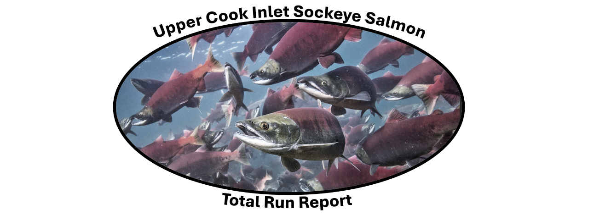

<center>



<center>

---
date: "`r Sys.Date()`"
output: html_document
---

```{=html}
<style type="text/css">
  body{
  font-family: times, serif;
}
</style>
```
<center>

### By: Kyle Gatt

<center>

```{r setup, include=FALSE}
library(tufte)
library(dplyr)
library(tidyverse)
library(ggplot2)
library(flextable)
library(officer)
library(stringr)
library(fuzzyjoin)
library(ggrepel)
library(tidyr)
library(tidyverse)
library(zoo)
library(scales)
library(flextable)
library(gghighlight)
knitr::opts_chunk$set(warning = FALSE, message = FALSE)

```

```{r, include=FALSE, echo=F}

# This script will replace the "Main" tab in the TR20XXworksheet.xlxs file for total run tracking and projections
#Step 1: Udate the date for which you are running this report:

Today<-as.Date("2024-07-10",format("%Y-%m-%d"))
Yesterday<-Today-1

#Step 2: Download UCI_Harvest from OceanAK and place in the "Harvest" folder
#Step 3: Update Daily Inseason Escapement Data (Fish Creek, Kenai, Kasilof)
#Step 4: Update Age estimates for Escapement and Commercial Catch in the Catch and Escapement Data folder:

#O:\SHAREDAT\Research\UCI Research Core\Projects\Catch and Escapement\2024 Catch & Escapement\Data\TOTAL_RUN_AGE_TRACKING...

#Step 5: Download Statweek 
Stat.Week2024<-read.csv(file("O:/DCF/UCI/Research/MNGMT/Ins/24/Total Run Tracking in R/Data/Stat.Week2024.csv"))%>%
  mutate(Stat.Start=as.Date(Stat.Start,format="%m/%d/%Y"),Stat.Stop=as.Date(Stat.Stop,format="%m/%d/%Y"))


#Check to ensure dates have not been changed following BOF cycle:
## Years will need to be updated
KA.GL.Stop<-"2024-06-25" # Kasilof Gillnet-Actual stop date is the 24th
KA.DP.Start<-"2024-06-25" #kasilof Dipnet-Actual start date is the 25th
KA.DP.Stop<-"2024-08-07" #Kasilof Dipnet- Actual stop date is the 7th

KE.DP.Start<-"2024-07-09" #Kenai Dipnet- Actual start date is the 10th
KE.DP.Stop<-"2024-08-01" #kenai Dipnet- Actual stop date is the 31st


################################################################################
# COMMERCIAL HARVEST
#This data is obtained from OceanAK->My folders->Inseason Total Run-> UCI_Harvest. Code below is importing datasets that are saved in the "Harvest" folder.
#However, you should not have to use this code as FDMS output should already have this data

# State Drift (All statistical areas except for Federal EEZ, Kasilof Terminal Harvest Area, and Chinitna Bay)
State.Drift<-read.csv(file("O:/DCF/UCI/Research/MNGMT/Ins/24/Harvest/UCI_Harvest.csv"))%>%mutate(Date=as.Date(Catch.Date,format="%Y-%m-%d"))%>%
  filter(Gear.Code==3)%>%filter(!Stat.Area.Name=="24426 - Kasilof Terminal Drift"&!Stat.Area.Name=="24511 - Chinitna Drift"&!Stat.Area.Name=="24464 - UCI EEZ")%>%
  group_by(Date)%>%
  summarize(Fishery.Project="Central District Drift - State Waters", Season.Total=sum(Count))

#Federal EEZ Drift
EEZ.Drift<-read.csv(file("O:/DCF/UCI/Research/MNGMT/Ins/24/Harvest/UCI_Harvest.csv"))%>%mutate(Date=as.Date(Catch.Date,format="%Y-%m-%d"))%>%
  filter(Gear.Code==3)%>%filter(Stat.Area.Name=="24464 - UCI EEZ")%>%
  group_by(Date)%>%
  summarize(Fishery.Project="UCI EEZ", Season.Total=sum(Count))

# Kenai Section (24442,24441,24432)
Kenai.Section<-read.csv(file("O:/DCF/UCI/Research/MNGMT/Ins/24/Harvest/UCI_Harvest.csv"))%>%mutate(Date=as.Date(Catch.Date,format="%Y-%m-%d"))%>%
  filter(Stat.Area.Name=="24432 - Kalifornsky North"|Stat.Area.Name=="24442 - Salamantof North"|Stat.Area.Name=="24441 - Salamantof South")%>%
  group_by(Date)%>%
  summarize(Fishery.Project="Kenai Section Set Net Fishery", Season.Total=sum(Count))

# Kasilof Section (24431,24422,24421)
Kasilof.Section<-read.csv(file("O:/DCF/UCI/Research/MNGMT/Ins/24/Harvest/UCI_Harvest.csv"))%>%mutate(Date=as.Date(Catch.Date,format="%Y-%m-%d"))%>%
  filter(Stat.Area.Name=="24421 - Ninilchik"|Stat.Area.Name=="24422 - Coho"|Stat.Area.Name=="24431 - Kalifonsky South")%>%
  group_by(Date)%>%
  summarize(Fishery.Project="Kasilof Section Set Net Fishery", Season.Total=sum(Count))

# Western (24520,24530,24540,24550)
Western<-read.csv(file("O:/DCF/UCI/Research/MNGMT/Ins/24/Harvest/UCI_Harvest.csv"))%>%mutate(Date=as.Date(Catch.Date,format="%Y-%m-%d"))%>%
  filter(Stat.Area.Name=="24530 - Tuxedni Bay"|Stat.Area.Name=="24520 - Silver Salmon"|Stat.Area.Name=="24540 - Polly Creek"|Stat.Area.Name=="24550 - Little Jack Slough"|
         Stat.Area.Name=="24610 - Kalgin Island West Side"|Stat.Area.Name=="24620 - Kalgin Island East Side"| #Kalgin Island
         Stat.Area.Name=="24555 - Big River"|Stat.Area.Name=="24560 - West Foreland"| #Kustatan
        Stat.Area.Name=="24510 - Chinitna Set")%>% #Chinitna Set
  group_by(Date)%>%
  summarize(Fishery.Project="Western Subdistrict Set Net Fishery", Season.Total=sum(Count))

# General Knik Arm (24710,24720,24730,24741,24742,24743)
Knik<-read.csv(file("O:/DCF/UCI/Research/MNGMT/Ins/24/Harvest/UCI_Harvest.csv"))%>%mutate(Date=as.Date(Catch.Date,format="%Y-%m-%d"))%>%
  filter(Stat.Area.Name=="24710 - Trading Bay"|Stat.Area.Name=="24720 - Tyonek"|Stat.Area.Name=="24730 - Beluga"|Stat.Area.Name=="24741 - Susitna Flats"|Stat.Area.Name=="24742 - Point Mackenzie"|  Stat.Area.Name=="24743 - Fire Island")%>%
  group_by(Date)%>%
  summarize(Fishery.Project="Northern District Set Net Fishery - General Subdistrict", Season.Total=sum(Count))

# Eastern (24770,24780,24790)
Eastern<-read.csv(file("O:/DCF/UCI/Research/MNGMT/Ins/24/Harvest/UCI_Harvest.csv"))%>%mutate(Date=as.Date(Catch.Date,format="%Y-%m-%d"))%>%
  filter(Stat.Area.Name=="24770 - Point Possession"|Stat.Area.Name=="24780 - Birch Hill"|Stat.Area.Name=="24790 - #3 Bay")%>%
  group_by(Date)%>%
  summarize(Fishery.Project="Northern District Set Net Fishery - Eastern Subdistrict", Season.Total=sum(Count))

#Kasilof Terminal (Includes drift and gillnet harvests; 24425,24426)
Kasilof.Terminal<-read.csv(file("O:/DCF/UCI/Research/MNGMT/Ins/24/Harvest/UCI_Harvest.csv"))%>%mutate(Date=as.Date(Catch.Date,format="%Y-%m-%d"))%>%
  filter(Stat.Area.Name=="24425 - Kasilof Terminal Set"|Stat.Area.Name=="24426 - Kasilof Terminal Drift")%>%
  group_by(Date)%>%
  summarize(Fishery.Project="Kasilof Terminal", Season.Total=sum(Count))


### Combine all
Commercial.Harvest<-rbind(State.Drift, EEZ.Drift, Kenai.Section, Kasilof.Section, Western, Knik, Eastern, Kasilof.Terminal)%>%group_by(Fishery.Project)%>%
  complete(Date = seq.Date(as.Date("2024-06-01",format="%Y-%m-%d"), Today, by="day"))%>%replace(is.na(.),0)
#Generating Cumulative Harvests
Commercial.Harvest.Cumu<-Commercial.Harvest%>%
  group_by(Fishery.Project)%>%mutate(Season.Total=cumsum(Season.Total),Fate="Commercial Harvest")


################################################################################
## Escapement
#Requires daily apportioned sockeye counts. Susitna runs are based on historical run timing and expanded by date of projection. 

#Susitna Projection
Forcast.Total.Run<-303400 #2024 forecast for Susitna stock sockeye
Assumed.Harvest.Rate<-.42 #Mean Harvest rate 2007-2015
Forecast.Escapement<-Forcast.Total.Run-(Forcast.Total.Run*Assumed.Harvest.Rate) #Multiple the harvest rate by projection to get projected escapement

SU.ESC<-read.csv(file("O:/DCF/UCI/Research/MNGMT/Ins/24/Escapement/Historical/Susitna_Run_Timing.csv"))%>%mutate(Date=as.Date(Date,format="%d-%b"))%>%
  mutate(Daily.Count=Mean.Daily.Prop*Forecast.Escapement,Fishery.Project="Susitna Escapement")%>%select(Date,Daily.Count,Fishery.Project)%>%
  filter(Date<=Yesterday)

#Fish Creek- Obtain from Fish Counts page on ADFG webpage
Fish.Creek<-read.csv(file("O:/DCF/UCI/Research/MNGMT/Ins/24/Escapement/Fish_Creek.csv"))%>%mutate(Date=as.Date(Date,format="%d-%b"))%>%
  mutate(Fishery.Project="Fish Creek Escapement")%>%filter(Date<=Yesterday)

#Sonar Sites- Obtained from "Escapement" folder
Kasilof.Sonar<-read.csv(file("O:/DCF/UCI/Research/MNGMT/Ins/24/Escapement/Kasilof_Sonar.csv"))%>%mutate(Date=as.Date(Date,format="%d-%b"))%>%
  mutate(Fishery.Project="Kasilof River Escapement")%>%filter(Date<=Yesterday)

Kenai.Sonar<-read.csv(file("O:/DCF/UCI/Research/MNGMT/Ins/24/Escapement/Kenai_Sonar.csv"))%>%mutate(Date=as.Date(Date,format="%d-%b"))%>%
  mutate(Fishery.Project="Kenai River Escapement")%>%filter(Date<=Yesterday)

#Crescent- Escapement estimated from harvest of the western district at a harvest rate of 0.463, which is based on GSI of harvest (2005-2021). 
#Please note, this harvest is the historical stat areas of the western reporting group
Crescent<-read.csv(file("O:/DCF/UCI/Research/MNGMT/Ins/24/Harvest/UCI_Harvest.csv"))%>%mutate(Date=as.Date(Catch.Date,format="%Y-%m-%d"))%>%
  filter(Stat.Area.Name=="24530 - Tuxedni Bay"|Stat.Area.Name=="24520 - Silver Salmon"|Stat.Area.Name=="24540 - Polly Creek"|Stat.Area.Name=="24550 - Little Jack Slough")%>%
  group_by(Date)%>%
  summarize(Season.Total=sum(Count))%>%
  group_by(Date)%>%summarize(Daily.Count=(Season.Total/0.463)-Season.Total)%>%mutate(Fishery.Project="Crescent Escapement")


Escapement<-rbind(SU.ESC,Fish.Creek,Kasilof.Sonar,Kenai.Sonar,Crescent)%>%group_by(Fishery.Project)%>%
  complete(Date = seq.Date(as.Date("2024-06-01",format="%Y-%m-%d"), Today, by="day"))%>%replace(is.na(.),0)

Escapement<-Escapement%>%rbind(Escapement%>%group_by(Date)%>%summarize(Daily.Count=sum(Daily.Count)*.15,Fishery.Project="Other"))# Adding in Unmonitored systems

Escapement.Cumu<-Escapement%>%group_by(Fishery.Project)%>%mutate(Season.Total=cumsum(Daily.Count))%>%
  select(Fishery.Project,Date,Season.Total)%>%
  mutate(Fate="Escapement")


################################################################################
# SUBSISTENCE AND PERSONAL USE PROJECTIONS
# This script is based on the "KENAI- Kasilof PU&SF projection" tab in the TR2023 file.

#First we must estimate harvest rates for each fishery
#Update Each Year
Current.Year<-2024

#Each season, the PU_Sport_HR file will need updated using Comm AMR Appendix A17 and Sport AMR T18 (Columns C and N)
#Note: Kasilof sport harvest is available from the statewide harvest survey webpage
#Also, historical sockeye counts will need updated as well.

#Season Dates
#Kasilof Gillnet-6/15 to 6/24
#Kasilof Dipnet- 6/25 to 8/7
#Kenai Dipnet- 7/10 to 7/31

#Data Wrangling and Reformatting
Hist.KeKa.Sonar<-read.csv(file("O:/DCF/UCI/Research/MNGMT/Ins/24/Escapement/Historical/KEKA_Hist_Sonar.csv"))
Hist.KeKa.Sonar$Date.Full<-as.Date(Hist.KeKa.Sonar$Date,format = "%d-%b")#create date that may be sorted chronologically

#This file will require updating each season.
PU_SPORT_HR<-read.csv(file("O:/DCF/UCI/Research/MNGMT/Ins/24/Harvest/PU_SPORT_HR.csv"))


#Estimate Mean Harvest for PU, Sub and Sport to apply to sonar counts 
#First set season dates and get average passage during those dates
KA.Gillnet<-Hist.KeKa.Sonar%>%filter(River=="Kasilof"&Date.Full>"2024-06-14"&Date.Full<"2024-06-25")%>%group_by(Year)%>%summarize(Kasilof.Sonar.Gillnet=sum(Daily.Count))
KA.Dip<-Hist.KeKa.Sonar%>%filter(River=="Kasilof",Date.Full>"2024-06-25"&Date.Full<"2024-08-07")%>%group_by(Year)%>%summarize(Kasilof.Sonar.Dipnet=sum(Daily.Count))
KA.Sport<-Hist.KeKa.Sonar%>%filter(River=="Kasilof")%>%group_by(Year)%>%summarize(Kasilof.Sonar=sum(Daily.Count))
KE.Dip<-Hist.KeKa.Sonar%>%filter(River=="Kenai",Date.Full>"2024-07-10"&Date.Full<"2024-07-31")%>%group_by(Year)%>%summarize(Kenai.Sonar.Dipnet=sum(Daily.Count))
KE.Sport<-Hist.KeKa.Sonar%>%filter(River=="Kenai")%>%group_by(Year)%>%summarize(Kenai.Sonar=sum(Daily.Count))

#Now estimate harvest rate
Inriver.Harvest<-PU_SPORT_HR%>%mutate(Kasilof.Harvest.Below=Kasilof.Gillnet+Kasilof.Dipnet+Kasilof.Sport.Below.Sonar,
                                                            Kenai.Harvest.Below=Kenai.Dipnet+Kenai.Sport.Below.Sonar)%>%
  left_join(KA.Gillnet)%>%left_join(KA.Dip)%>%left_join(KA.Sport)%>%left_join(KE.Dip)%>%left_join(KE.Sport)%>%
  mutate(Kasilof.Gillnet.Harvestrate=Kasilof.Gillnet/(Kasilof.Gillnet+Kasilof.Sonar.Gillnet),
         Kasilof.Dipnet.Harvestrate=Kasilof.Dipnet/(Kasilof.Dipnet+Kasilof.Sonar.Dipnet),
         Kasilof.Sport.Harvestrate=Kasilof.Sport.Below.Sonar/(Kasilof.Sport.Below.Sonar+Kasilof.Sonar),
         Kenai.Dipnet.Harvestrate=Kenai.Dipnet/(Kenai.Dipnet+Kenai.Sonar.Dipnet),
         Kenai.Sport.Harvestrate=Kenai.Sport.Below.Sonar/(Kenai.Sport.Below.Sonar+Kenai.Sonar))%>%
  select(1,17:21)%>%
  filter(Year<Current.Year&Year>Current.Year-6)%>% #Take 5-year average
  summarize(across(2:6,mean,na.rm=T))


###
# Kasilof 
Kasilof.Gillnet<-read.csv(file("O:/DCF/UCI/Research/MNGMT/Ins/24/Escapement/Kasilof_Sonar.csv"))%>%mutate(Date=as.Date(Date,format="%d-%b"))%>%
  mutate(Harvest=ifelse(Date<KA.GL.Stop,(Daily.Count*Inriver.Harvest$Kasilof.Gillnet.Harvestrate)/(1-Inriver.Harvest$Kasilof.Gillnet.Harvestrate),0))%>%
  filter(Date<=Yesterday)%>%
  mutate(Fishery.Project="Kasilof Personal Use Gillnet")%>%
  select(Date,Harvest,Fishery.Project)

Kasilof.Dipnet<-read.csv(file("O:/DCF/UCI/Research/MNGMT/Ins/24/Escapement/Kasilof_Sonar.csv"))%>%mutate(Date=as.Date(Date,format="%d-%b"))%>%
  mutate(Harvest=ifelse(Date>=KA.DP.Start&Date<KA.DP.Stop,(Daily.Count*Inriver.Harvest$Kasilof.Dipnet.Harvestrate)/(1-Inriver.Harvest$Kasilof.Dipnet.Harvestrate),0))%>%
  filter(Date<=Yesterday)%>%
  mutate(Fishery.Project="Kasilof Personal Use Dipnet")%>%
  select(Date,Harvest,Fishery.Project)

Kasilof.Sport<-read.csv(file("O:/DCF/UCI/Research/MNGMT/Ins/24/Escapement/Kasilof_Sonar.csv"))%>%mutate(Date=as.Date(Date,format="%d-%b"))%>%
  mutate(Harvest=(Daily.Count*Inriver.Harvest$Kasilof.Sport.Harvestrate)/(1-Inriver.Harvest$Kasilof.Sport.Harvestrate))%>%
  filter(Date<=Yesterday)%>%
  mutate(Fishery.Project="Kasilof Sport")%>%
  select(Date,Harvest,Fishery.Project)%>%
  mutate(Harvest=Harvest*2) #Bag limit was doubled to 6 during the 2024 BOF Meeting

# Kenai
Kenai.Dipnet<-read.csv(file("O:/DCF/UCI/Research/MNGMT/Ins/24/Escapement/Kenai_Sonar.csv"))%>%mutate(Date=as.Date(Date,format="%d-%b"))%>%
  mutate(Harvest=ifelse(Date>KE.DP.Start&Date<KE.DP.Stop,(Daily.Count*Inriver.Harvest$Kenai.Dipnet.Harvestrate)/(1-Inriver.Harvest$Kenai.Dipnet.Harvestrate),0))%>%
  filter(Date<=Yesterday)%>%
  mutate(Fishery.Project="Kenai Personal Use Dipnet")%>%
  select(Date,Harvest,Fishery.Project)

Kenai.Sport<-read.csv(file("O:/DCF/UCI/Research/MNGMT/Ins/24/Escapement/Kenai_Sonar.csv"))%>%mutate(Date=as.Date(Date,format="%d-%b"))%>%
  mutate(Harvest=(Daily.Count*Inriver.Harvest$Kenai.Sport.Harvestrate)/(1-Inriver.Harvest$Kenai.Sport.Harvestrate))%>%
  filter(Date<=Yesterday)%>%
  mutate(Fishery.Project="Kenai Sport")%>%
  select(Date,Harvest,Fishery.Project)%>%
  mutate(Harvest=Harvest*2) #Bag limit was doubled to 6 during the 2024 BOF Meeting


UCI.PU.SF<-rbind(Kasilof.Gillnet,Kasilof.Dipnet,Kasilof.Sport,Kenai.Dipnet,Kenai.Sport)%>%
  group_by(Fishery.Project)%>%
  complete(Date = seq.Date(as.Date("2024-06-01",format="%Y-%m-%d"), Today, by="day"))%>%replace(is.na(.),0)
  
  
UCI.PU.SF.Cumu<-UCI.PU.SF%>%group_by(Fishery.Project)%>%mutate(Season.Total=cumsum(Harvest))%>%
  select(Fishery.Project,Date,Season.Total)%>%
  mutate(Fate="Personal Use and Sport")


###############################################################################
# OTF
#NOT BEING RUN IN 2024

#OTF<-read.csv(file("O:/DCF/UCI/Research/MNGMT/Ins/24/Harvest/OTF_Harvest.csv"))%>%mutate(Date=as.Date(Date,format="%d-%b"))%>%
#  mutate(Fate="Commercial Harvest", Fishery.Project="OTF", Season.Total=cumsum(Count))%>%select(1,3,4,5)

################################################################################
################################################################################  
# Combine All Fates- Estimates from this will be used in the age allocation model for stock specific return estimates via the Age allocation model in "Age_Composition Script"

Page1<-rbind(Commercial.Harvest.Cumu,Escapement.Cumu,UCI.PU.SF.Cumu)

Inseason.Total.Run<-Page1%>%group_by(Date,Fate)%>%summarize(Total.Return=sum(Season.Total,na.rm = T))

Total.Run.By.Date<-Inseason.Total.Run%>%group_by(Date)%>%summarize(Inseason.Total=as.integer(sum(Total.Return)))

```

::: {style="margin-bottom:10px;"}
:::

# Inseason Total Run Tracking

**Table 1.-** Cumulative harvest and passage estimates to date of Upper Cook Inlet (UCI) sockeye salmon. All personal use and sport harvest estimates are projections based on recent five-year average harvest rates within each fishery. Susitna River escapement is based on the average harvest rate of this stock in UCI commercial salmon fisheries (42%; 2007 to 2015), the average run timing, and pre-season forecasts. Crescent River escapement is based on the commercial sockeye salmon harvest in the western district and average harvest rate of this stock (46.3% from 2006 to 2021) within that fishery.

```{r, echo=F}

Page1%>%filter(Date%in%Yesterday)%>%select(-c(Date))%>%select(Fate,Fishery.Project,Season.Total)%>%
  rbind(Page1%>%filter(Date%in%Yesterday)%>%select(-c(Date))%>%select(Fate,Fishery.Project,Season.Total)%>%
  group_by(Fate)%>%summarize(Season.Total=sum(Season.Total))%>%mutate(Fishery.Project="Subtotal"))%>%
  arrange(Fate)%>%
  flextable()%>%
  merge_v(j=1)%>%
   align(align="left",j=1,part="all")%>%
  valign(valign = "top")%>%
  line_spacing(space=1,part = "all")%>%
  add_body( Fate="Grand Total",
            Season.Total=(Page1%>%filter(Date%in%Yesterday)%>%ungroup()%>%summarize(Count=sum(Season.Total)))[[1,1]],top=F)%>%
  bg(i= ~Fishery.Project%in%"Subtotal",bg="grey95")%>%
  set_header_labels(Fishery.Project="Allocation",Season.Total="Cumulative Season Total")%>%
  colformat_double(j=3,digits=0)%>%
   font(fontname="serif",part="all")%>%
   fix_border_issues()%>%
  autofit()

```

::: {style="margin-bottom:30px;"}
:::

# Age Allocation Modeling

```{r, inlcude=F,echo=F}

#Assign the stat week for later trimming
Stat.Today<-
  (Stat.Week2024%>%rowwise()%>%do(data.frame(Stat.Week=.$Stat.Week,Date=seq(.$Stat.Start,.$Stat.Stop,by='1 day')))%>%filter(Date%in%Yesterday))$Stat.Week

################################################################################
#Historically, a UCI Age Composition Report was pulled from FDMS and put into the Age Compositions folder. In 2024, the aging team decided entered data in excel would be much more efficient.
#For details and code for pre-generated UCI age comp report, see Age_Allocation_Inseason in the 2023 folder.
# This season we will generate this report here.
###############################################################################


##Generating Age Comp Report For Commercial Harvest
UCI.Commercial.Ages.0<-read.csv(file("O:/SHAREDAT/Research/UCI Research Core/Projects/Catch and Escapement/2024 Catch & Escapement/Data/TOTAL_RUN_AGE_TRACKING/COMMERCIAL_CATCH_AGES.csv"))%>%
 select(Date.of.Fishery,Sampling.Group,Age)%>%filter(!Age%in%NA)%>% 
  mutate(Date.of.Fishery=as.Date(Date.of.Fishery,format="%d-%b"))%>%
  rename(Fishery.Project=Sampling.Group,Date=Date.of.Fishery)%>%
                            fuzzy_left_join(Stat.Week2024,by=c("Date"="Stat.Start","Date"="Stat.Stop"),match_fun=list(`>=`,`<=`))%>%select(-c(Stat.Start,Stat.Stop))

UCI.Commercial.Ages<-UCI.Commercial.Ages.0%>%group_by(Fishery.Project,Stat.Week,Age)%>%summarize(Count=n())%>%group_by(Fishery.Project,Stat.Week)%>%mutate(Samples=sum(Count))

#Add Commercial Harvest Data by sampling period for later Weighting
UCI.Commercial.Ages<-UCI.Commercial.Ages%>%
  left_join(Commercial.Harvest%>%fuzzy_left_join(Stat.Week2024,by=c("Date"="Stat.Start","Date"="Stat.Stop"),match_fun=list(`>=`,`<=`))%>%select(-c(Stat.Start,Stat.Stop))%>%
  group_by(Fishery.Project,Stat.Week)%>%summarize(Index=sum(Season.Total)))


##Generating Age Comp Report For Escapements
UCI.Escapement.Ages.0<-read.csv(file("O:/SHAREDAT/Research/UCI Research Core/Projects/Catch and Escapement/2024 Catch & Escapement/Data/TOTAL_RUN_AGE_TRACKING/ESCAPEMENT_AGES.csv"))%>%
  select(Date.of.Fishery,Sampling.Group,Age)%>%filter(!Age%in%NA)%>% 
  mutate(Date.of.Fishery=as.Date(Date.of.Fishery,format="%d-%b"))%>%
  rename(Fishery.Project=Sampling.Group,Date=Date.of.Fishery)%>%
  fuzzy_left_join(Stat.Week2024,by=c("Date"="Stat.Start","Date"="Stat.Stop"),match_fun=list(`>=`,`<=`))%>%select(-c(Stat.Start,Stat.Stop))
  
UCI.Escapement.Ages<-UCI.Escapement.Ages.0%>%group_by(Fishery.Project,Stat.Week,Age)%>%summarize(Count=n())%>%left_join(
  UCI.Escapement.Ages.0%>%group_by(Fishery.Project,Stat.Week)%>%summarize(Samples=n()))

#Add Escapement Data by sampling period for later Weighting
UCI.Escapement.Ages<-UCI.Escapement.Ages%>%left_join(Escapement%>%
                                                       fuzzy_left_join(Stat.Week2024,by=c("Date"="Stat.Start","Date"="Stat.Stop"),match_fun=list(`>=`,`<=`))%>%select(-c(Stat.Start,Stat.Stop))%>%
                                                       group_by(Fishery.Project,Stat.Week)%>%summarize(Index=sum(Daily.Count)))


##Combing Commercial and Escapement Age Comp Data
Age.Comp<-rbind(UCI.Escapement.Ages, UCI.Commercial.Ages)%>%
  mutate(Gear=ifelse(Fishery.Project=="Central District Drift - State Waters"|Fishery.Project=="UCI EEZ",3, #Assigning gear codes for later analysis
                                                        ifelse(Fishery.Project=="Kenai River Escapement"|
                                                                 Fishery.Project=="Kasilof River Escapement"|
                                                                 Fishery.Project=="Fish Creek"|
                                                                 Fishery.Project=="Judd Lake"|
                                                                 Fishery.Project=="Larson Creek",14,4))) #Assigning Weir gear code)

#Because we do not sample every stat week we must account for this in our cumulative index counts and only cumulatively count the escapement and harvests of sampled periods
Cumu.Index<-Age.Comp%>%group_by(Fishery.Project,Stat.Week)%>%summarize(Index=unique(Index))%>%
  group_by(Fishery.Project)%>%mutate(Index.Cumu=cumsum(Index))%>%select(Fishery.Project,Stat.Week,Index.Cumu)


#Now add to age comp report
Age.Comp<-Age.Comp%>%left_join(Cumu.Index)

#Generating weighted Comps

   A1<-Age.Comp%>%mutate(Count.Period=round((Count/Samples)*Index))%>% #Proportion an age class makes up -> number of individuals in that age class for that sampled period
    group_by(Fishery.Project,Age)%>%mutate(Cumu.Count=cumsum(Count.Period))%>% #Cumulative count of individuals in that age class across sampled periods
    mutate(Weighted=round(Cumu.Count/Index.Cumu,digits = 3))%>% #The proportion an age class makes up of the cumulative sampled periods (weighted age compositions)
    select(Fishery.Project,Stat.Week,Age,Weighted)%>%ungroup()%>%
    complete(Fishery.Project,Stat.Week,Age)%>%arrange(Fishery.Project,Stat.Week,Age)%>%
     group_by(Fishery.Project,Stat.Week)%>%mutate(Weighted.Total=sum(Weighted,na.rm=T),Weighted.Corrected=ifelse(Weighted.Total>0&Weighted%in%NA,0,Weighted))%>%
    group_by(Fishery.Project,Age)%>%
     fill(Weighted.Corrected,.direction = "updown")
     
 
 
    A2<-A1%>%group_by(Fishery.Project,Age)%>%
    complete(Stat.Week = seq(22,Stat.Today, by=1))%>%arrange(Fishery.Project,Stat.Week,Age)%>%
    group_by(Fishery.Project,Age)%>%
    fill(Weighted.Corrected,.direction = "updown")%>% #fill forward age comps until we get updated age comps
    ungroup()%>%select(-c(Weighted,Weighted.Total))%>%
    left_join(Stat.Week2024)%>%
    group_by(Fishery.Project,Stat.Week,Age,Weighted.Corrected)%>%
    expand(Date=as.Date(Stat.Start:Stat.Stop),.name_repair = "unique")%>%ungroup()%>% #expand to weighted age comps to daily 
    filter(Date<=Yesterday&Date>=as.Date("2024-06-01",format("%Y-%m-%d")))
    

Age.Comp.Weighted<-A2%>%rename(Weighted=Weighted.Corrected)%>%arrange(Fishery.Project,Date,Age)

#Adding Cumulative Season Totals
Age.Comp.Weighted<-Age.Comp.Weighted%>%left_join(Page1%>%select(-Fate))%>%arrange(Fishery.Project,Date)


###############################################################################
# Harvest Age Compositions
# The UCI age composition report pulls harvest data from Mariner. Thus, the "index" column is the number of fish harvested within each specific period. 
# Each year, the periods will need to be updated in FDMS. 

# Because we will not have the data inseason for most escapement projects and some will not operate, we will use alternatives. (see TR2023worksheet->Page 2)

#ESCAPEMENT
# Susitna = Larson-> Susitna Forecast 
# Yentna = Judd-> Susitna Forecast
# Fish Creek = Fish Creek Forecast
# Crescent = Western Commercial Harvest
# Other = Central District Drift Fishery

# HARVEST
# Kustatan = Western Commercial Harvest
# Chinitna Bay = Central District Drift Fishery
# Knik Arm = Fish Creek Forecast
# Kasilof Terminal = 2015 Terminal Harvest Age Comp


#Adding in alternative age comps but using harvests and escapements (see Page 2 of the TR2023worksheet)
Alternatives<- rbind(
  
  #Adding Remaining Escapements
    Escapement.Cumu%>%filter(Fishery.Project%in%c("Susitna Escapement","Fish Creek Escapement"))%>%select(-Fate)%>%
    left_join(read.csv(file("O:/DCF/UCI/Research/MNGMT/Ins/24/Total Run Tracking in R/Data/Age.Comp.Forecasts.csv")),relationship = "many-to-many")%>%
      fuzzy_left_join(Stat.Week2024,by=c("Date"="Stat.Start","Date"="Stat.Stop"),match_fun=list(`>=`,`<=`))%>%select(-c(Stat.Start,Stat.Stop)),
 
  Age.Comp.Weighted%>%filter(Fishery.Project%in%"Western Subdistrict Set Net Fishery")%>% #For Crescent 
    transform(Fishery.Project=plyr::revalue(Fishery.Project,c("Western Subdistrict Set Net Fishery"="Crescent Escapement")))%>%select(-Season.Total)%>%
    left_join(Escapement.Cumu%>%filter(Fishery.Project%in%"Crescent Escapement")%>%select(1:3)),

  Age.Comp.Weighted%>%filter(Fishery.Project%in%"Central District Drift - State Waters")%>% #Unmonitored Systems
    transform(Fishery.Project=plyr::revalue(Fishery.Project,c("Central District Drift - State Waters"="Other")))%>%select(-Season.Total)%>%
    left_join(Escapement.Cumu%>%filter(Fishery.Project%in%"Other")%>%select(1:3)),
  
  #Kalgin and Kustatan Harvests and age comps are grouped in western District Harvest
  
  # PAGE 4:Adding Personal Use and Sportfish Harvest Projections
  Age.Comp.Weighted%>%filter(Fishery.Project%in%"Kasilof River Escapement")%>% 
    transform(Fishery.Project=plyr::revalue(Fishery.Project,c("Kasilof River Escapement"="Kasilof Personal Use Gillnet")))%>%select(-Season.Total)%>%
    left_join(UCI.PU.SF.Cumu%>%filter(Fishery.Project%in%"Kasilof Personal Use Gillnet")%>%select(1:3)),
  
  Age.Comp.Weighted%>%filter(Fishery.Project%in%"Kasilof River Escapement")%>% 
    transform(Fishery.Project=plyr::revalue(Fishery.Project,c("Kasilof River Escapement"="Kasilof Personal Use Dipnet")))%>%select(-Season.Total)%>%
    left_join(UCI.PU.SF.Cumu%>%filter(Fishery.Project%in%"Kasilof Personal Use Dipnet")%>%select(1:3)),
  
  Age.Comp.Weighted%>%filter(Fishery.Project%in%"Kasilof River Escapement")%>%
    transform(Fishery.Project=plyr::revalue(Fishery.Project,c("Kasilof River Escapement"="Kasilof Sport")))%>%select(-Season.Total)%>%
    left_join(UCI.PU.SF.Cumu%>%filter(Fishery.Project%in%"Kasilof Sport")%>%select(1:3)),
  
  Age.Comp.Weighted%>%filter(Fishery.Project%in%"Kenai River Escapement")%>%
    transform(Fishery.Project=plyr::revalue(Fishery.Project,c("Kenai River Escapement"="Kenai Personal Use Dipnet")))%>%select(-Season.Total)%>%
   left_join(UCI.PU.SF.Cumu%>%filter(Fishery.Project%in%"Kenai Personal Use Dipnet")%>%select(1:3)),
  
  Age.Comp.Weighted%>%filter(Fishery.Project%in%"Kenai River Escapement")%>% 
    transform(Fishery.Project=plyr::revalue(Fishery.Project,c("Kenai River Escapement"="Kenai Sport")))%>%select(-Season.Total)%>%
    left_join(UCI.PU.SF.Cumu%>%filter(Fishery.Project%in%"Kenai Sport")%>%select(1:3)))


#Combine alternative age comp data to Age.Comp.Weighted dataset
Page2<- Age.Comp.Weighted%>%rbind(Alternatives)%>%mutate(Total.Fish=Season.Total*Weighted)%>%ungroup()


#Page2%>%group_by(Fishery.Project,Date)%>%summarize(Weighted.Total=sum(Total.Fish),actual.total=unique(Season.Total))%>%mutate(Test=actual.total-Weighted.Total)%>%arrange(desc(Test))

################################################################################ 
############################################################################### 
# AGE ALLOCATION MODELING
# This section is based in the TRXXXworksheet.xlsx (Tab: Pages 6:12)

# Page 6
Adjusted.Age.Comp<-Page2%>%mutate(Stock=ifelse(Fishery.Project%in%c("Kasilof River Escapement", "Kasilof Personal Use Gillnet","Kasilof Personal Use Dipnet", "Kasilof Sport"),"Kasilof",
                                               ifelse(Fishery.Project%in%c("Kenai River Escapement","Kenai Personal Use Dipnet","Kenai Sport"),"Kenai",
                                                      ifelse(Fishery.Project%in%"Susitna Escapement","Susitna",ifelse(
                                                        Fishery.Project%in%"Crescent Escapement","Crescent",
                                                        ifelse(Fishery.Project%in%"Fish Creek Escapement","Fish Creek",
                                                               ifelse(Fishery.Project%in%"Other","Other","NA")))))))%>%filter(!Stock%in%"NA")%>%
  group_by(Stock,Age,Date)%>%summarize(Stock.Total=sum(Total.Fish))


# Page 7-Area Adjustments
#This section will be used to choose what stock should be attributed to which fishery. Area adjustments are updated with 2021-2023 GSI data

#Adjusted percent of age classes for Susitna, Kenai, Kasilof, Fish Creek, and Other
Adjusted.2<-Adjusted.Age.Comp%>%filter(!Stock%in%"Crescent")%>%group_by(Age,Date)%>%mutate(Adjusted.Percent=Stock.Total/sum(Stock.Total,na.rm=T))%>%replace(is.na(.), 0)
#Adjusted percent of age classes for Kenai, and Kasilof
Adjusted.3<-Adjusted.Age.Comp%>%filter(Stock%in%c("Kenai",'Kasilof'))%>%group_by(Age,Date)%>%mutate(Adjusted.Percent=Stock.Total/sum(Stock.Total,na.rm=T))%>%replace(is.na(.), 0)
#Adjusted percent of age classes for Susitna, Fish Creek, and Other
Adjusted.4<-Adjusted.Age.Comp%>%filter(Stock%in%c("Susitna",'Fish Creek',"Other"))%>%group_by(Age,Date)%>%mutate(Adjusted.Percent=Stock.Total/sum(Stock.Total,na.rm=T))%>%replace(is.na(.), 0)
#Adjusted percent of age classes for Crescent
Adjusted.5<-Adjusted.Age.Comp%>%filter(Stock%in%c("Crescent"))%>%group_by(Age,Date)%>%mutate(Adjusted.Percent=Stock.Total/sum(Stock.Total,na.rm=T))%>%replace(is.na(.), 0)
#Adjusted percent of age classes for All (NEW in 2024)
Adjusted.6<-Adjusted.Age.Comp%>%group_by(Age,Date)%>%mutate(Adjusted.Percent=Stock.Total/sum(Stock.Total,na.rm=T))%>%replace(is.na(.), 0)


# Page 8 and 9- Applying area adjustment to commercial harvest
#Allocation of Commercial Harvest
Allocation.Commercial<-rbind(
  #Drift State Waters- Primary stock harvests are all but crescent
  Adjusted.2%>%left_join(Page2%>%filter(Fishery.Project%in%"Central District Drift - State Waters")%>%select(Date,Age,Total.Fish))%>%replace(is.na(.), 0)%>%
    mutate(Total.Adjusted=Adjusted.Percent*Total.Fish)%>%mutate(Fishery.Project="Central District Drift - State Waters"),
  
  #UCI EEZ- All stocks are harvested in this fishery
  Adjusted.6%>%left_join(Page2%>%filter(Fishery.Project%in%"UCI EEZ")%>%select(Date,Age,Total.Fish))%>%replace(is.na(.), 0)%>%
    mutate(Total.Adjusted=Adjusted.Percent*Total.Fish)%>%mutate(Fishery.Project="UCI EEZ"),
  
  #Kenai Section
  Adjusted.3%>%left_join(Page2%>%filter(Fishery.Project%in%"Kenai Section Set Net Fishery")%>%select(Date,Age,Total.Fish))%>%replace(is.na(.), 0)%>%
    mutate(Total.Adjusted=Adjusted.Percent*Total.Fish)%>%mutate(Fishery.Project="Kenai Section Set Net Fishery"),
  
  #Kasilof Section
  Adjusted.3%>%left_join(Page2%>%filter(Fishery.Project%in%"Kasilof Section Set Net Fishery")%>%select(Date,Age,Total.Fish))%>%replace(is.na(.), 0)%>%
    mutate(Total.Adjusted=Adjusted.Percent*Total.Fish)%>%mutate(Fishery.Project="Kasilof Section Set Net Fishery"),
  
  #Western Set Net Fisheries- This district harvests all stocks but has a high degree of variability
  Adjusted.6%>%left_join(Page2%>%filter(Fishery.Project%in%"Western Subdistrict Set Net Fishery")%>%select(Date,Age,Total.Fish))%>%replace(is.na(.), 0)%>%
    mutate(Total.Adjusted=Adjusted.Percent*Total.Fish)%>%mutate(Fishery.Project="Western Subdistrict Set Net Fishery"),
  
  #Northern District-General 
  Adjusted.4%>%left_join(Page2%>%filter(Fishery.Project%in%"Northern District set Net Fishery - General Subdistrict")%>%select(Date,Age,Total.Fish))%>%replace(is.na(.), 0)%>%
    mutate(Total.Adjusted=Adjusted.Percent*Total.Fish)%>%mutate(Fishery.Project="Northern District set Net Fishery - General Subdistrict"),
  
  #Northern District-Eastern
  Adjusted.4%>%left_join(Page2%>%filter(Fishery.Project%in%"Northern District set Net Fishery - Eastern Subdistrict")%>%select(Date,Age,Total.Fish))%>%replace(is.na(.), 0)%>%
    mutate(Total.Adjusted=Adjusted.Percent*Total.Fish)%>%mutate(Fishery.Project="Northern District set Net Fishery - Eastern Subdistrict"),
  
  #Kasilof Terminal Drift
   Adjusted.3%>%left_join(Page2%>%filter(Fishery.Project%in%"Kasilof Terminal")%>%select(Date,Age,Total.Fish))%>%replace(is.na(.), 0)%>%
    mutate(Total.Adjusted=Adjusted.Percent*Total.Fish)%>%mutate(Fishery.Project="Kasilof Terminal"))


# Pages 10 and 11
#Page9<-Allocation.Commercial%>%group_by(Fishery.Project,Age,Date)%>%mutate(Fishery.Age.Total=sum(Total.Adjusted))%>%
#  select(Age,Date,Total.Fish,Stock)
#  left_join(Page2%>%select(Fishery.Project,Date,Age,Weighted,Total.Fish))%>%
#  mutate(Remainder=Total.Fish-Fishery.Age.Total)

#################################################################################
## Aggregating data

#Total Commercial 
Total.Allocation.Commercial<-Allocation.Commercial%>%group_by(Stock,Age,Date)%>%summarize(UCI.Total=sum(Total.Adjusted))%>%mutate(Fate="Commercial Harvest")

#Total Escapement
Total.Allocation.Escapement<-Page2%>%filter(Fishery.Project%in%c("Kasilof River Escapement","Kenai River Escapement","Crescent Escapement","Fish Creek Escapement","Susitna Escapement","Other"))%>%
  transform(Stock=plyr::revalue(Fishery.Project,c("Kasilof River Escapement"="Kasilof", "Kenai River Escapement"="Kenai", 
                                                  "Crescent Escapement"="Crescent","Fish Creek Escapement"="Fish Creek","Susitna Escapement"="Susitna","Other"="Other")))%>%
  select(Age,Date,Total.Fish,Stock)%>%rename(UCI.Total=Total.Fish)%>%mutate(Fate="Escapement")

#Total PU & Sport
Total.Allocation.PUSPORT<-Page2%>%filter(Fishery.Project%in%c("Kasilof Personal Use Gillnet","Kasilof Personal Use Dipnet","Kasilof Sport","Kenai Personal Use Dipnet","Kenai Sport"))%>%
  transform(Stock=plyr::revalue(Fishery.Project,c("Kasilof Personal Use Gillnet"="Kasilof","Kasilof Personal Use Dipnet"="Kasilof","Kasilof Sport"="Kasilof","Kenai Personal Use Dipnet"="Kenai","Kenai Sport"="Kenai")))%>%
  select(Age,Date,Total.Fish,Stock)%>%rename(UCI.Total=Total.Fish)%>%mutate(Fate="Personal Use and Sport")

###Combining All Fates
Total.Allocation.UCI<-rbind(Total.Allocation.Commercial,Total.Allocation.Escapement,Total.Allocation.PUSPORT)


################################################################################
# Page 12
Inseason.Totals<-Total.Allocation.UCI%>%group_by(Date)%>%summarize(AccumRun1=sum(UCI.Total))%>%left_join(Total.Run.By.Date)


```

**Table 2.-** Cumulative total run estimates to date for primary Upper Cook Inlet sockeye salmon stocks.

```{r,echo=F}

Total.Allocation.UCI%>%group_by(Stock,Fate)%>%filter(Date%in%Yesterday)%>%summarize(Total=sum(UCI.Total))%>%
  rbind(Total.Allocation.UCI%>%group_by(Stock)%>%filter(Date%in%Yesterday)%>%summarize(Total=sum(UCI.Total),Fate="Subtotal"))%>%arrange(Stock)%>%
 flextable()%>%
  merge_v(j=1:2)%>%
   align(align="left",j=1:2,part="all")%>%
  valign(valign = "top")%>%
  line_spacing(space=1,part = "all")%>%
  bg(i= ~Fate%in%"Subtotal",bg="grey95")%>%
  colformat_double(j=3,digits=0)%>%
   font(fontname="serif",part="all")%>%
  hline(i=c(3,6,10,14,17),j=2:3,part="body")%>%
   fix_border_issues()%>%
  autofit()


```

# Total Run Projections

Inseason total run projections for UCI sockeye salmon stocks had historically relied on cumulative catch-per-unit-effort timing curves from the offshore test fish project. This method provided unbiased estimates of run timing because performance of this fishery is largely independent of management actions. In 2024, the OTF project

```{r, inlcude=F,echo=F}

#################################################################################
######## DATA WRANGLING AND GROOMING ############################################

#Loading prior year total inseason allocation results
Allocation.23<-read.csv(file("O:/DCF/UCI/Research/MNGMT/Ins/23/Final Results/Final.Age.Allocations.Results.csv"))%>%group_by(Stock,Date)%>%summarize(Total=sum(UCI.Total))%>%filter(Stock%in%c("Kenai","Kasilof"))%>%
  mutate(Date=as.Date(Date,format="%m/%d/%Y"),Date=Date%m+% years(1))%>%mutate(Year=2023)

#Gathering inseason allocation results
Allocation.24<-Total.Allocation.UCI%>%filter(Stock%in%c("Kasilof","Kenai"))%>%group_by(Stock,Date)%>%summarize(Total=sum(UCI.Total))%>%mutate(Year=2024)


Hist.Allocations<-read.csv(file("O:/DCF/UCI/Research/MNGMT/Ins/24/Total Run Tracking in R/Total.Run.Allocations.csv"))%>%mutate(Date=as.Date(Date,format="%m/%d/%Y"))%>%arrange(Year,Stock,Date)%>%select(-Method)


Total.Runs<-rbind(Allocation.23,Allocation.24,Hist.Allocations)

  #group_by(Stock,Year)%>%
  #complete(Date = seq(as.Date("06-01-2024",format="%m-%d-%Y"),as.Date("08-15-2024",format="%m-%d-%Y"), by="1 day"))%>%
  #fill(Total,Method,.direction = "updown")


### PREPARING TIMING DAT
#Generating Inriver Run Timing
Inriver.Timing<-Hist.KeKa.Sonar%>%select(River,Year,Date,Daily.Count)%>%filter(Year>2000)%>%
  group_by(River,Year)%>%mutate(Timing=cumsum(Daily.Count)/max(cumsum(Daily.Count)),Date=as.Date(Date,format="%d-%b"))%>%select(-Daily.Count)%>%
  group_by(River)%>%
  complete(Year,Date)%>%
  group_by(River,Year)%>%
  fill(Timing,.direction = "updown")%>%rename(Stock=River)


Timing.Date<-rbind(Inriver.Timing%>%arrange(Year,Date)%>%group_by(Stock,Date)%>%mutate(Timing_5=lag(rollapplyr(Timing, 5, mean, partial = T)),
                                                                                                             Timing_10=lag(rollapplyr(Timing, 10, mean, partial = T))),
                   Inriver.Timing%>%group_by(Stock,Date)%>%summarize(Timing_5=mean(ifelse(Year>2018,Timing,NA),na.rm=T),Timing_10=mean(ifelse(Year>2013,Timing,NA),na.rm=T))%>%mutate(Year=2024))


## Bringing in Total Runs
Actual.Runs<-rbind(read.csv(file("O:/DCF/UCI/Research/Forecast/Preseason/2024/Kenai/Kenai.Brood.csv"))%>%select(Brood.Year,Run)%>%rename(Year=Brood.Year)%>%mutate(Stock="Kenai"),
                  read.csv(file("O:/DCF/UCI/Research/Forecast/Preseason/2024/Kasilof/Kasilof.Brood.csv"))%>%select(Brood.Year,Run)%>%rename(Year=Brood.Year)%>%mutate(Stock="Kasilof"))


Inseason.Projection<-Timing.Date%>%filter(Year==2024)%>%select(-c(Timing,Timing_5))%>%left_join(Allocation.24)%>%
  group_by(Stock)%>%
  mutate(Early_10.1=Total/lead(Timing_10),
         Early_10.2=Total/lead(Timing_10,n=2),
         Early_10.3=Total/lead(Timing_10,n=3),
        Ontime_10=Total/Timing_10,
         Late_10.1=Total/lag(Timing_10),
         Late_10.2=Total/lag(Timing_10,n=2),
         Late_10.3=Total/lag(Timing_10,n=3))


#Looking at Projection scenarios
Inseason.Daily.Projection<-Timing.Date%>%filter(Year==2024)%>%select(Stock,Date,Timing_10)%>%
  left_join(Inseason.Projection%>%filter(Date%in%Yesterday)%>%select(Stock,Early_10.1:Late_10.3))%>%
  mutate(Ontime.Projection=Ontime_10*Timing_10)%>%group_by(Stock)%>%
  mutate(Early3.Projection=Early_10.3*lead(Timing_10,n=3),
         Early2.Projection=Early_10.2*lead(Timing_10,n=2),
         Early1.Projection=Early_10.1*lead(Timing_10,n=2),
         Late3.Projection=Late_10.3*lag(Timing_10,n=3),
         Late2.Projection=Late_10.2*lag(Timing_10,n=2),
         Late1.Projection=Late_10.1*lag(Timing_10,n=1))%>%
  select(-c(Early_10.1:Late_10.3))%>%
  left_join(Total.Allocation.UCI%>%filter(Stock%in%c("Kasilof","Kenai"))%>%group_by(Stock,Date)%>%summarize(Total=sum(UCI.Total)))%>%
  mutate(Forecast=ifelse(Stock%in%"Kenai",3380460,1115161))

```

**Table X.-**

```{r,echo=F}

Inseason.Projection%>%group_by(Stock)%>%na.omit()%>%filter(Date%in%Yesterday)%>%
select(c(Stock,Early_10.3,Early_10.2,Early_10.1,Ontime_10,Late_10.1,Late_10.2,Late_10.3))%>%
flextable()%>%
set_header_labels(Early_10.3="Three Days Early",
Early_10.2=" Two Days Early",
Early_10.1=" One Day Early",
Ontime_10="On Time",
Late_10.1="One Day Late",
Late_10.2="Two Days Late",
Late_10.3="Three Days Late")%>%
colformat_double(j=2:8,digits=0)%>%
  align(j=1:8,align = "center",part="all")%>%
  font(fontname="serif",part="all")%>%
  fix_border_issues()%>%
  autofit()

```

**Table X.-**

```{r,echo=F}
Inseason.Daily.Projection%>%mutate(
                                   Early_10.3=abs(Total-Early3.Projection)/Total,
                                   Early_10.2=abs(Total-Early2.Projection)/Total,
                                   Early_10.1=abs(Total-Early1.Projection)/Total,
                                   Ontime_10=abs(Total-Ontime.Projection)/Total,
                                   Late_10.1=abs(Total-Late1.Projection)/Total,
                                   Late_10.2=abs(Total-Late2.Projection)/Total,
                                   Late_10.3=abs(Total-Late3.Projection)/Total)%>%
  filter_all(all_vars(!is.infinite(.)))%>%
  group_by(Stock)%>%summarise(across(Early_10.3:Late_10.3, mean, na.rm=TRUE))%>%
  select(c(Stock,Early_10.3,Early_10.2,Early_10.1,Ontime_10,Late_10.1,Late_10.2,Late_10.3))%>%
  
  flextable()%>%
set_header_labels(Early_10.3="Three Days Early",
Early_10.2=" Two Days Early",
Early_10.1=" One Day Early",
Ontime_10="On Time",
Late_10.1="One Day Late",
Late_10.2="Two Days Late",
Late_10.3="Three Days Late")%>%
colformat_double(j=2:8,digits=2)%>%
  align(j=1:8,align = "center",part="all")%>%
  font(fontname="serif",part="all")%>%
  fix_border_issues()%>%
  autofit()

```

```{r,echo=F}
Test<-Inseason.Daily.Projection%>%pivot_longer(Ontime.Projection:Late1.Projection, names_to = "Timing_Senario",values_to = "Projection")%>%filter(Date>=as.Date("2024-06-15",format="%Y-%m-%d"))%>%
  mutate(Error=abs(Total-Projection)/Total)%>% filter_all(all_vars(!is.infinite(.)))%>%group_by(Stock,Timing_Senario)%>%
  mutate(Count=1,Running.Error=cumsum(coalesce(Error,0))/cumsum(Count))

Test.2<-Test%>%group_by(Stock,Timing_Senario)%>%summarize(MAPE=mean(Error,na.rm=T))%>%group_by(Stock)%>%filter(MAPE%in%min(MAPE))%>%mutate(Timing_Select=Timing_Senario)%>%select(Stock,Timing_Select)
  
Test%>%left_join(Test.2)%>%mutate(Projection=round(Projection,digits=0))%>%
  ggplot()+
  geom_line(aes(Date,Projection,group=Timing_Senario),size=1.5)+
  facet_grid(Stock~.,scales="free")+
  gghighlight(Timing_Senario==Timing_Select ,calculate_per_facet = TRUE,label_key = Projection,
              unhighlighted_params = list(linewidth = 1, colour = alpha("grey", 0.7)))+
  geom_line(aes(Date,Total),size=2,color=2)+
  scale_y_continuous(labels = comma)+
  ylab("Total Run")+
  xlab("")+
  theme_bw()
 
```
